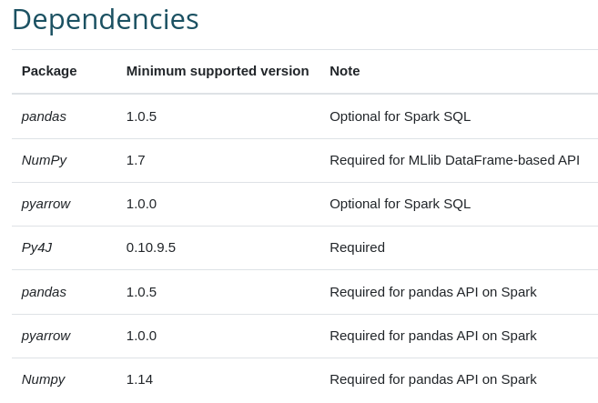
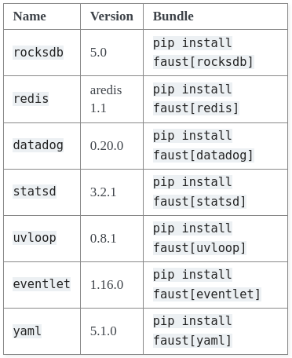

# FRACTAL Component WP6T62-01 Data Ingestion

The objective of this Fractal component is to provide a set of instructions and tools to perform ETL operations on the Fractal Edge Node.

Data may come into the Fractal Edge Node in various forms, formats, file sizes, and from various sources. This resembles the necessity of a Fractal component which can deal with all these heterogeneous types of data.

This component will be based on the usage of open-source existing software and tools to cover the Extract, Transform and Load (ETL) process, both for the ARM and the RISCV (64 and 32-bit versions) processor architectures. It will also provide installation steps, and troubleshooting steps in case they are required.

However, as this component is purely based on open-source robust and reliable software, the usage guides about how to perform ETL operations will be only referenced as Documentation, as it would be of overwhelming complexity to give a full comprehensive usage guide for any possible use case scenario and data format/type.

### How does the component satisfy the WP/FRACTAL objectives?

WP6T62-01 Data Ingestion component provides a unified set of tools to be implemented in the Fractal Edge Node. These tools cover the management of any source of incoming data into the Edge node, and will address the following WP6 objectives (in bold):

- **Analysis of existing open-source edge and cloud platforms implementations in order to determine a potential
FRACTAL reference engineering framework.** It will consist of: (i) an edge processing platform and (ii) an edge controller infrastructure.
- Design and implementation of the FRACTAL software processing framework based on microservices for the integration of processing capacities (AI and safe autonomous decision algorithms developed in WP5) and **enabling the connection of IoT devices using standard or proprietary protocols over Ethernet and cellular networks.**
- Edge platform orchestration, monitoring the physical and application integrity at edge locations with the ability to
autonomously enable corrective actions when necessary.
- **Specification of a generic data model and common interface to communicate with the cloud.**
- Design and implementation of the FRACTAL edge node controller infrastructure (in the cloud) for the management
and update of the edge processing platform.
- Adaptation of the FRACTAL software components to allow a fractal growth (scalability) from low to the high
computing edge node.
- Test and validation of the FRACTAL engineering framework by means of simulations and preliminary laboratory
trials (TRL4).
- Integration, test and validation of the FRACTAL wireless communications nodes (4G/5G, NB-IoT/LTE-M, as stand-
alone subsystem (TRL6).

## Getting Started

In this section a set of instructions is given to install and run your ETL components in the different supported processor architectures for the Fractal Edge Node (ARM64, RISCV64 and RISCV32):

### ARM64 & RISCV64 (High and Mid-End Nodes)

ARM is the most popular processor architecture for IoT devices and Edge computing frameworks. This is why it has the most complete set of tools to be installed. For this component, two open source ETL tools are proposed, one for Java and one for Python programming languages:

- Java based tool: Apache NiFi

Although Java is not the preferred programming language in Edge computing architectures, an exception is to be made with Apache NiFi as the overall best performing open-source ETL tool available. It is widely used for data stream processing and counts with a verry wide and active community. If an ETL and stream processing tool is required, Apache NiFi is highly recommended and reliable.

- Python based tools:

In case Python is preferred over Java for your specific appilcation, or Apache NiFi lacks any specific functionality required for your use case, two other open source and Python-based alternatives are given: Apache Spark (PySpark) and Faust.

- Others:

A third alternative is given as a flow-based programming tool, Node-RED, written on JavaScript and commonly used as an IoT data flow tool because the big number of plugins availble from the community.

```
Node-RED consists of a Node.js based runtime that you point a web browser at to access the flow editor.

Within the browser you create your application by dragging nodes from your palette into a workspace and start to wire them together.

With a single click, the application is deployed back to the runtime where it is run.
```


## Prerequisites

* Apache NiFi
  * Requires Java 8 or Java 11
  * Supported OS:
    * Linux, Unix, Windows, macOS
  * Local installation:
    * Download the binaries or Sources from the [Official Download Page](https://nifi.apache.org/download.html)
  * Docker installation:
    * Download the images from the [Official NiFi DockerHub](https://hub.docker.com/r/apache/nifi)

* Apache Spark (PySPark)
  * Python3.8 or above
  * pip3
  * Java 8 or later with JAVA_HOME section
  * For ARM users, PyArrow is required for PySpark SQL, if PyArrow installation fails, try installing PyArrow >= 4.0.0

* Node-RED
  * Local installation: A supported version of Node.js.
  * Docker installation: Docker Engine
  * From source:
    * A supported version of Node.js
    * A `git` client
    * The `grunt-cli` npm module installed locally.

* Faust
  * Python3.6 or above
  * A running Kafka broker

## Installation

### Apache NiFi

First, and assuming you are working on a Linux OS, download the tarball file from https://nifi.apache.org/download.html . Then, decompress the file into the desired installation directory.

**Starting Apache NiFi**

Decompress and untar into desired installation directory

Make any desired edits in files found under <installdir>/conf

At a minimum, it is recommended editing the nifi.properties file and entering a password for the nifi.sensitive.props.key (see System Properties below). This `nifi.properties` file has many configuration aspects that should be reviewed before starting the application, like ports where to expose the HTTP/HTTPs user interfaces, user/password credentials, network interfaces to use, etc.

Once you have configured your NiFi environment, from the <installdir>/bin directory, execute the following commands by typing `./nifi.sh <command>`:

```
start: starts NiFi in the background

stop: stops NiFi that is running in the background

status: provides the current status of NiFi

run: runs NiFi in the foreground and waits for a Ctrl-C to initiate shutdown of NiFi

install: installs NiFi as a service that can then be controlled via

service nifi start

service nifi stop

service nifi status

```
These commands are used to control your application process, stop and restart the service, or check the application status. Once your application is running, you can visit the UI at (by default) https://localhost:8000.

By default, the installation script generated a random username and password that can be edited in the nifi.properties file. If using the default configuration (which is highly deprecated), the credentials can be found in the application logs at logs/nifi-app.log, under the Generated Username and Generated Password lines.

To change the Username and Password you can execute the command:

```
$ ./bin/nifi.sh set-single-user-credentials <username> <password>
```

And then access the dashboard where you can create your dataflows from the User Interface at https://localhost:8443/nifi (again, it is recommended to change this default port in the NiFi properties file).

**Docker container deployment**

Once you are familiar with how NiFi works and are able to install it and deploy the application on bare metal servers, you are ready to deploy NiFi as a Docker container. While you can directly run a Docker container, it is highly encouraged to install the application first to get a deeper insight on how it works and how to configure it.

The Official Docker Image can be found on [NiFi's Official DockerHub](https://hub.docker.com/r/apache/nifi/#!), where you can also find all the required information to configure and run the container.

### PySpark

[Apache Spark](https://spark.apache.org/) is a multi-language engine for executing data engineering, data science, and machine learning on single-node machines or clusters.

PySpark is available as a Python3 package, it can be installed by executing:

```
pip install pyspark
```

Take into account that Spark requires the following Python package dependencies:



### NodeRed

To install NodeRed there are three available possibilities:

- Installing with npm
- Installing with Docker
- Installing with snap

**npm**

```
sudo npm install -f --unsafe-perm node-red
```

And confirm the installation was successful in the end of the command output:

```
+ node-red@1.1.0
added 332 packages from 341 contributors in 18.494s
found 0 vulnerabilities
```

**Docker (recommended)**

```
docker run -it -p 1880:1880 -v node_red_data:/data --name mynodered nodered/node-red
```

This command will create a Docker container and a data volume at /data for your node-red container. Going to http://<your-ip>:1880 will bring you to the User Interface

### Faust

Faust is a stream processing library, that processes from Apache Kafka streams, built in Python. It supports the following extensions:



The main advantage of Faust is that it is a Python library and fully based on Python, so you can integrate it with any other Python library or system as long as you have a Kafka stream to process. Faust can publish and consume from Kafka streams and perform stream processing operations in a distributed manner.

To install Faust, just run:

```
pip install faust
```

## Additional Documentation and Acknowledgments

* NiFi Documentation:
  * [Getting Started](https://nifi.apache.org/docs/nifi-docs/html/getting-started.html#starting-nifi)
  * [Documentation](https://nifi.apache.org/docs.html)
  * [System Administrator's Guide](https://nifi.apache.org/docs/nifi-docs/html/administration-guide.html#system_requirements)
* PySpark Documentation:
  * [Getting Started](https://spark.apache.org/docs/latest/api/python/getting_started/index.html)
  * [Documentation](https://spark.apache.org/docs/latest/)
* Node-RED Documentation:
  * [Docs](https://nodered.org/docs/)
  * [User Guide](https://nodered.org/docs/user-guide/)
  * [Getting Started](https://nodered.org/docs/getting-started/local)
* Faust Documentation:
  * [Documentation](https://faust.readthedocs.io/en/latest/)
  * [Useful information](https://faust.readthedocs.io/en/latest/introduction.html)


